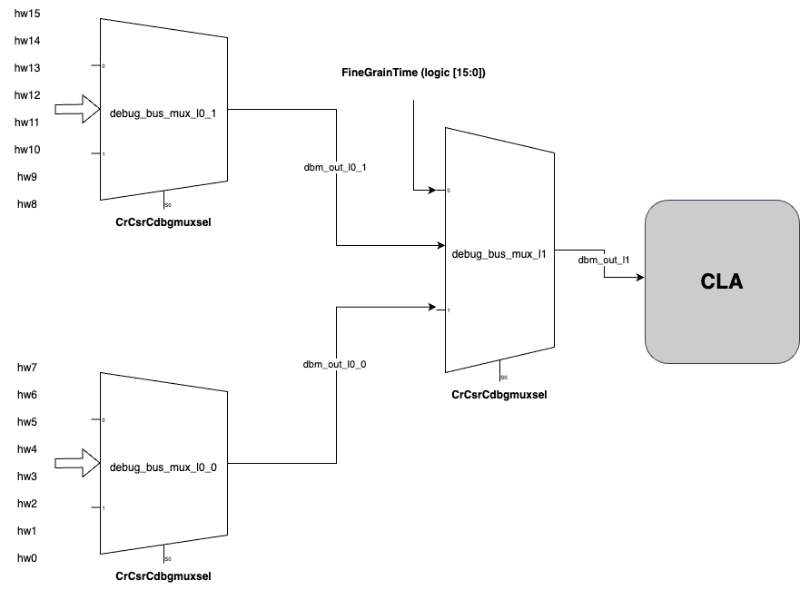

# CLA DocGen Example
This is an example for how to use the CLA docgen script. The example here models the current DFD module with 3 Debug Muxes and their respective debug lanes (and widths).

| File      | Description |
| ----------- | ----------- |
| example_dfd_debug_mux_cfg.json | Config file that describes the debug mux inputs and topology. This is the input for the docGen script. |
| example_dfd_debug_bus_info.json | Primary output of the docGen script |
| example_dfd_rtl.sv | Example Verilog file that contains the debug mux setup described by example_dfd_debug_mux_cfg.json. The docGen script does not need this file. |
| example_dfd_pkg.vh | Verilog package file that is referenced in both example_dfd_rtl.sv and example_dfd_debug_mux_cfg.json. This file is parsed by docGen script to extract struct, enum, and parameter info. |

The example verilog module has 3 CLA debug muxes instantiated, which is controlled by by one mux select CSR.\
These muxes are nested as shown below:\


When modifying inputs that comply with the existing design, only inputs to L0 muxes (`debug_bus_mux_l0_0` and `debug_bus_mux_l0_1`) can be modified. That is to say, please keep inputs to `debug_bus_mux_l1` the way they are in the example alongside the debug lane parameters. 

Note that for connecting signals to DBM, the actual inputs in RTL are hw0 - hw15. Each hw0 corresponds to the respective debug signal lane as indicated in the example and image. I.e. if in the input json, signal `logic [15:0] X` was added to LSB of `debug_bus_mux_l0_1`. Signal `X` in RTL should be connected to `hw8`. Signals that span over multiple or between `hw`s should be connected similarily in RTL.     

The output file `scriptOutput_dbmInfo.json` was generated using the following command:
```console
python generateClaDoc.py --jsonOutputPath example_dfd_debug_bus_info.json example_dfd_debug_mux_cfg.json
```